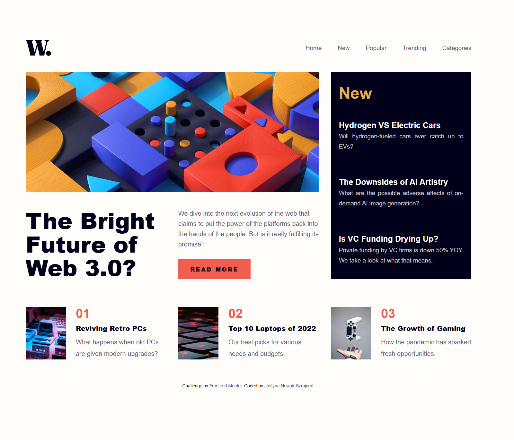
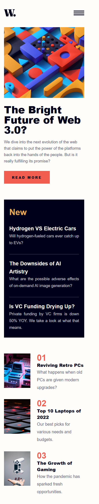
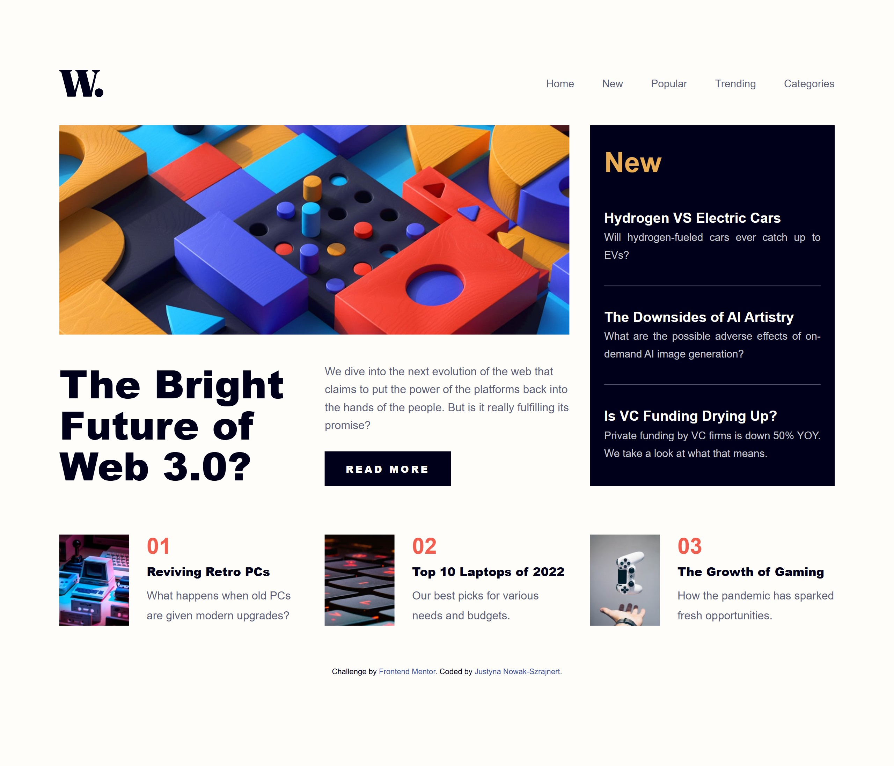
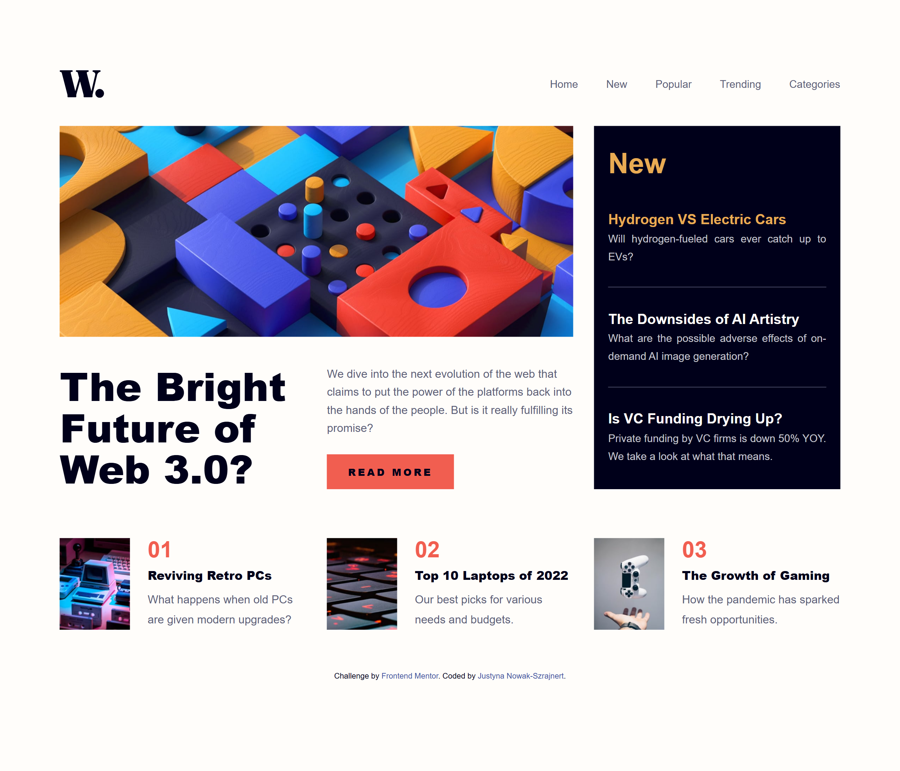
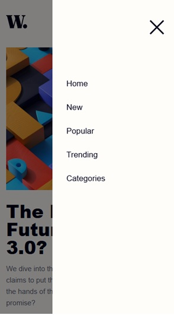

# Frontend Mentor - News homepage solution

This is a solution to the [News homepage challenge on Frontend Mentor](https://www.frontendmentor.io/challenges/news-homepage-H6SWTa1MFl). Frontend Mentor challenges help you improve your coding skills by building realistic projects. 

## Table of contents

- [Overview](#overview)
  - [The challenge](#the-challenge)
  - [Screenshots & Visuals](#screenshots--visuals)
  - [Links](#links)
- [My process](#my-process)
  - [Built with](#built-with)
  - [What I learned](#what-i-learned)
  - [AI Collaboration](#ai-collaboration)
- [Author](#author)

## Overview

### The challenge

Users should be able to:

- View the optimal layout for the interface depending on their device's screen size
- See hover and focus states for all interactive elements on the page
- Open and close the navigation menu on mobile devices using a smooth overlay navigation

### Screenshots & Visuals

Below are the screenshots of the completed project views located in the `solution` folder, showcasing the actual implementation:

#### Base Layouts
* **Desktop Design View:**
  The complete 3-column CSS Grid layout structure optimized for spacious monitors.
  

* **Mobile Design View:**
  The stacked, fluid single-column layout targeting handheld modern smartphone dimensions.

  

#### Interactive Active States
* **Full Active Overview Compilation:**
  Demonstrates mouse cursor hover dynamics changing font colors and backgrounds across various sections simultaneously.
  

* **Navigation Menu Link Hover State:**
  Changes targeted navbar links seamlessly using CSS transition colors (`--soft-red`).
  

* **Main Call-To-Action Button State:**
  The `Read more` primary button scales seamlessly to an inverted dark accent background color variant upon hovering.
  

* **Sidebar News Item Title State:**
  Hovering over individual sidebar article headings dynamically triggers an illumination change to `--soft-orange`.
  

* **Mobile Menu Overlay Navigation:**
  The interactive mobile drawer sidebar configuration safely rendering the dark dimming backdrop surface layout.
  
  

### Links

- Solution URL: [Frontend Mentor Solution]()
- Live Site URL: [Add live site URL here](https://jusnow1608.github.io/news-homepage-javascript/)

## My process

### Built with

- Semantic HTML5 markup
- CSS Custom Properties (Variables) with modern `hsl()` syntax
- Accessible components (e.g., `aria-label` for screen readers)
- Flexbox for components alignment
- CSS Grid for the master 3-column desktop view layout
- Mobile-first workflow
- Responsive typography and spacing using modern `rem` units
- Vanilla JavaScript for responsive sidebar menu toggling

### What I learned

During this project, I significantly leveled up my understanding of responsive design, web accessibility, and modern layout systems.

Key takeaways:
1. **The power of `rem` units & Accessibility:** Moving from rigid pixels to fluid `rem` units ensures that the layout expands beautifully if users change their default browser font sizes.
2. **Modern HSL alpha syntax:** I learned how to use the modern CSS color syntax (`hsl(0 0% 0% / 0.5)`) to create accessible background mask overlays for mobile states.
3. **Responsive JavaScript:** Implementing robust resize events to safely reset the UI state if a user changes orientation from mobile to desktop.

```css
/* Proud of this modern, clean utility variable configuration */
:root {
  --very-dark-blue: hsl(240, 100%, 5%);
  --box-shadow: hsl(0 0% 0% / 0.5);
}

body {
  font-size: 0.9375rem; /* Exactly 15px derived symmetrically */
}
```
```js
/* Proud of this reliable backdrop click listener for mobile navigation dismissal */
document.body.addEventListener("click", (e) => {
    if (menu.classList.contains("open") && !e.target.closest(".menu") && !e.target.closest(".menu-hamburger")) {
        menu.classList.remove("open");
        x_button.classList.remove("open");
    }
});
```

### AI Collaboration
For this development lifecycle, I collaborated dynamically with an AI coding partner to analyze design parameters, debug multi-device breakpoints, and refactor formatting conventions.

Tools Used: Gemini (Google).

How it helped: * Acted as a precise code reviewer to spot hidden syntax anomalies (like trailing double semicolons).

Provided optimal mathematical scaling calculations to migrate a classic pixel-based stylesheet layout smoothly into production-ready rem accessibility values.

Guided architectural decisions regarding when components should use CSS Grid versus Flexbox axes alignment.

## Author
- GitHub - [@Jusnow1608](https://github.com/Jusnow1608)
- Frontend Mentor - [@Jusnow1608](https://www.frontendmentor.io/profile/Jusnow1608)
- LinkedIn - [@Justyna-Nowak-Szrajnert](https://www.linkedin.com/in/justyna-nowak-szrajnert-a5168713b/)